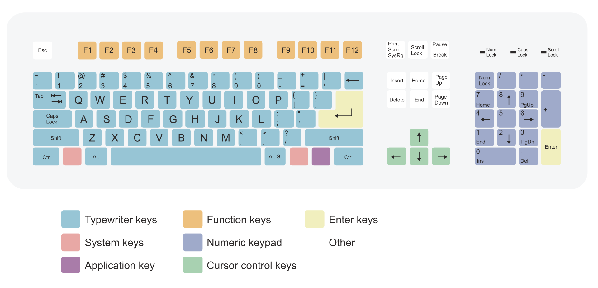

# debian-clonezilla-multistrap

# Introduction

This project is based on my previous work "debian-multistrap" that was meant to build an X2go server.
In this instance the gold is to build a laptop/desktop image with the next items 
- Debian 12 Bookworm 
- Backport kernel for newer HW compatibility
- Latest Libreoffice
- Latest Google Chrome 
- Latest XFCE 
- Latest Firefox ESR
- Latest Clonezilla recovery

# Requirements

- Internet : wired is easier but here are the steps for wifi.
  - Libreoffice, Google Chrome and Clonezilla will be downloaded directly 
- USB thumbdrive : if you choose to use dd command it will be formatted.
- Laptop or desktop with:
  - UEFI
  - 32 GB or more storage device. It will be parted:
    - 1) EFI partition
    - 2) Clonezilla + Recovery partition
    - 3) System partition
    - 4) Temporally partition to download resources. It may be deleted after to have [Over-provisioning](https://www.kingston.com/en/blog/pc-performance/overprovisioning)

# Installation steps.

## Step 1 : Download debian live iso standard

- [For brand new devices (Weekly build)](https://cdimage.debian.org/cdimage/weekly-live-builds/amd64/iso-hybrid/debian-live-testing-amd64-standard.iso)

- [For everything else (Current build)](https://cdimage.debian.org/debian-cd/current-live/amd64/iso-hybrid/)

## Step 2 : Copy Iso to pendrive using ventoy or dd

- [Download Ventoy](https://www.ventoy.net/en/download.html)

- Creating USB booteable from iso file: Replace iso file route and usb device
  ```
  sudo dd bs=4M if=/route/to/file.iso of=/dev/sdx status=progress oflag=sync
  ```

## Step 4 : Run live via USB

## Step 5 : Connect device to internet if necesary

- #### Connect cable if its possible.

- #### If wifi is only option
  - ###### Get wireless card name
  ```
  ip -br a
  ```
  - ###### Enable link (If wifi card name is wlan0)
  ```
  sudo ip link set wlan0 up
  ```
  - ###### Get network name, if you don't know SSID.
  ```
  iwlist wlan0 scan | grep SSID
  ```
  - ###### Set wifi configuration
  ```
  sudo wpa_passphrase "SSID" "your_wifi_password" | sudo tee /etc/wpa_supplicant.conf
  ```
  - ###### Connect to wireless network
  ```
  sudo wpa_supplicant -B -i wlan0 -c /etc/wpa_supplicant.conf
  ```
  - ###### Request ip address
  ```
  sudo dhclient wlan0
  ```

## Step 6 : Run script
```
$ sudo bash -c "$(curl -fsSL vicentech.com.ar/notebook)"
```
PS: As default iso layout is english, use the next map to find the special characters keys
 https://en.wikipedia.org/wiki/Keyboard_layout

# Post-installation steps

- ## Optional : Create non sudoer user with encrypted home
  - Boot normally debian install.
  - Logon with local admin user created during installation.
  - Open a terminal and run "useradd-encrypt" script.
    - Complete username.
    - Enter sudo password.
    - Enter twice the password for non sudoer encrypted user.
    - Enter a passphrase for emergency decryption.
    - Enter once again users password.
    - Wait for automatic reboot.

- ## Optional : Make additional special changes to image before next step.

- ## Create debian image for recovery.
  - Boot into "Restaurar" option.
    - Select "Salvar imagen" option.
    - Wait to password prompt, enter it twice.
    - Wait for clonezilla to do its jobs. PC will shutdown on completion.

- ## Optional : Remove 4th partition to have spare space to OP.
  - Boot Debian and login into sudoer user.
  - Open a terminal and run 
    - ```lsblk | grep disk```
      - You should see the storage device name.
    - ```sudo parted /dev/${DEVICE} --script rm 4```
      - Device variable must be replaced to sda, nvme0n1 or whatever name

- ## Optional : Take an entire disk image.
  - Boot PC with an Image software usb drive.
  - Take manual steps acording to your software.

- ## Start using the device.
  - First time booting it will recovery it self.
    - This is done for smaller disk image on previous step.

# Enjoy
