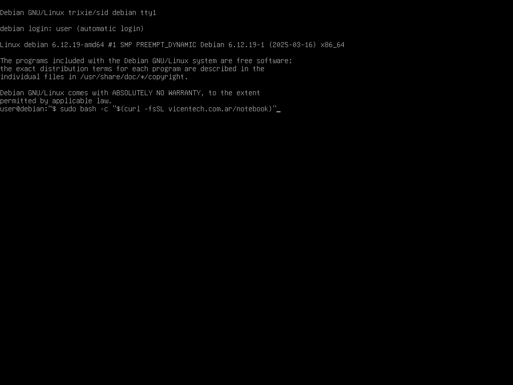

# debian-clonezilla-multistrap

# Introduction

This project builds upon my previous work, ***"debian-multistrap"***, which was designed to set up an X2go server.
In this instance, the goal is to build a laptop/desktop image with the following components :
- Debian 12 Bookworm.
- Backport kernel for improved hardware compatibility.
- Latest Libreoffice.
- Latest Google Chrome.
- Latest XFCE.
- Latest Firefox ESR.
- Latest Clonezilla recovery.

# Requirements

- ***Internet :*** wired connections is easier, but Wi-Fi setop steps are included below.
  - Libreoffice, Google Chrome and Clonezilla will be downloaded directly.
- ***USB thumb drive :*** if you choose to use ```dd``` command, it will be formatted.
- ***Laptop or desktop with:***
  - UEFI support.
  - 32 GB or more storage. The drive will be partitioned as follows :
    1. EFI partition
    2. Clonezilla + Recovery partition
    3. System partition
    4. Temporary partition to download resources (can be deleted afterward to allow for [Over-provisioning](https://www.kingston.com/en/blog/pc-performance/overprovisioning)

# Installation Steps.

## Step 1 : Download Debian Live ISO (Standard).

- [For brand-new devices (Weekly build)](https://cdimage.debian.org/cdimage/weekly-live-builds/amd64/iso-hybrid/debian-live-testing-amd64-standard.iso)

- [For everything else (Current build)](https://cdimage.debian.org/debian-cd/current-live/amd64/iso-hybrid/)

## Step 2 : Copy ISO to USB Drive using Ventoy or ```dd```.

- [Download Ventoy](https://www.ventoy.net/en/download.html)
  - [Ventoy guide](https://www.ventoy.net/en/doc_start.html)

- To create a bootable USB from the iso file, replace the file path and USB device as needed :
  ```
  sudo dd bs=4M if=/path/to/file.iso of=/dev/sdX status=progress oflag=sync
  ```

## Step 3 : Boot into Live System via USB.

## Step 4 : Connect Device to the Internet (if needed).

- #### ***Wired connection*** is preferred.

- #### ***If Wi-Fi is only option:***
  - ###### Get the name of your wireless card :
  ```
  ip -br a
  ```
  - ###### Enable the interface (replace ```wlan0``` with your interface name) :
  ```
  sudo ip link set wlan0 up
  ```
  - ###### Scan for available networks :
  ```
  iwlist wlan0 scan | grep SSID
  ```
  - ###### Set up the Wi-Fi configuration :
  ```
  sudo wpa_passphrase "SSID" "your_wifi_password" | sudo tee /etc/wpa_supplicant.conf
  ```
  - ###### Connect to wireless network :
  ```
  sudo wpa_supplicant -B -i wlan0 -c /etc/wpa_supplicant.conf
  ```
  - ###### Request an IP address :
  ```
  sudo dhclient wlan0
  ```

## Step 5 : Run the installation Script
  ```
  sudo bash -c "$(curl -fsSL vicentech.com.ar/notebook)"
  ```
  ***Note :*** The default ISO keyboard layout is English. Refer to the layout map to find special charactes :
   https://en.wikipedia.org/wiki/Keyboard_layout

## Installation walkthrough
- ***Grub from ISO :*** just hit enter.

- ***Installation command :*** make sure all characters are correct before hitting enter.

- ***Disk comfirmation prompt : ***

- ***Clean disk first run: *** Here we can see that the extra-packages as Clonezilla download directly from official mirrors.
  Please not that Clonezilla at least from Argentina takes a long time to download. 
  GOOD THINGS TAKE TIME.


# Post-installation Steps

- ## Optional : Create a non-sudoer user with encrypted home
  - Boot into the installed Debian system.
  - Log in with the admin user created during installation.
  - Open a terminal and run ```useradd-encrypt``` script.
    - Provide the username.
    - Enter your sudo password.
    - Enter the password for the new user twice.
    - Enter a passphrase for emergency decryption.
    - Enter the user's password again.
    - Wait for automatic reboot automatically.

- ## Optional : Make any additional customizations before proceeding.

- ## Create a Debian image for recovery.
  - Boot into the ***"Restaurar"*** option.
    - Select ***"Salvar imagen"*** option.
    - When prompted, enter a recovery password twice.
    - Wait for clonezilla to complete its process. The system will shut down afterward.

- ## Optional : Remove the 4th partition to allow Over-Provisioning (OP).
  - Boot into Debian and log in with a sudo-enabled user.
  - Open a terminal and run :
    - ```lsblk | grep disk```
      - Identify the correct device name (e.g., ```sda```, ```nvme0n1```, etc.).
    - ```sudo parted /dev/${DEVICE} --script rm 4```
      - Replace ```${DEVICE}``` with the actual name.

- ## Optional : Take a full disk image.
  - Boot the PC using a USB drvie with your preferred imaging software.
  - Connect an external storage to allocate the image.
  - Follow the software's manual steps to capture the image.

- ## Start using the device.
  - On the first boot, the device will automatically restore itself.
    - This is done to reduce the size of the disk image created earlier.

# Enjoy :rocket:
